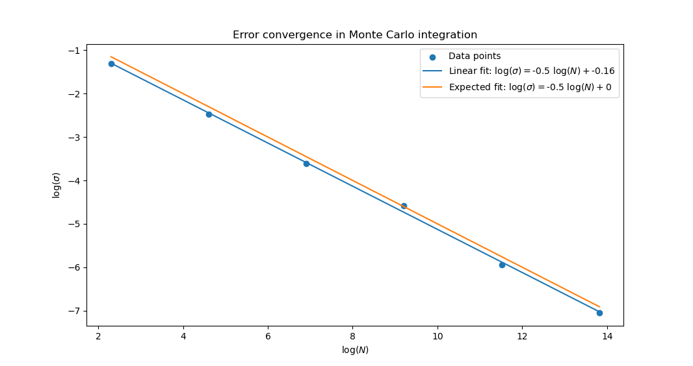

# Fifth Problem Set
> Iago Braz Mendes (T01362926)

## Center of mass of a non-uniform object

```
M = 31.99406523285886
Xcom = 0.0505231988926326
Ycom = 0.22917580052433065
Zcom = 0.000348161327988107
```

## Error convergence in Monte Carlo integration


