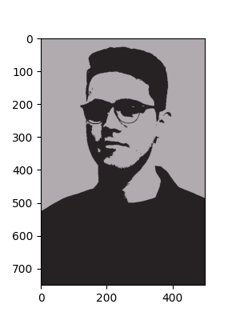
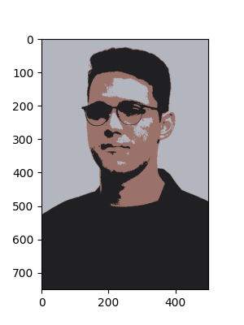
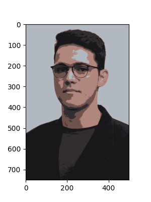
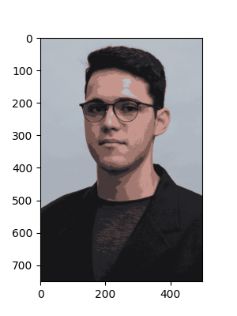
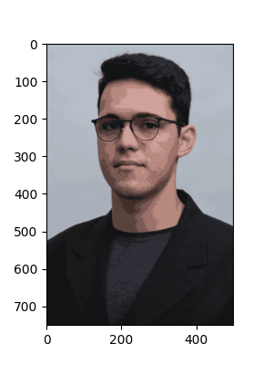

# Seventh Problem Set
> Iago Braz Mendes (T01362926)

## Results using Iago's headshot

- `ngroups = 2`

	

- `ngroups = 3`

	

- `ngroups = 5`

	

- `ngroups = 10`

	

- `ngroups = 15`

	

- `ngroups = 20`

	

- `ngroups = 32`

	

- `ngroups = 50`

	